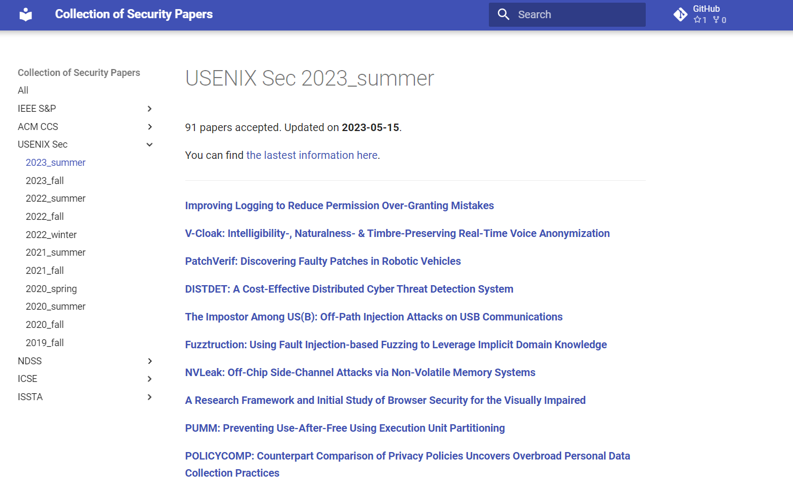
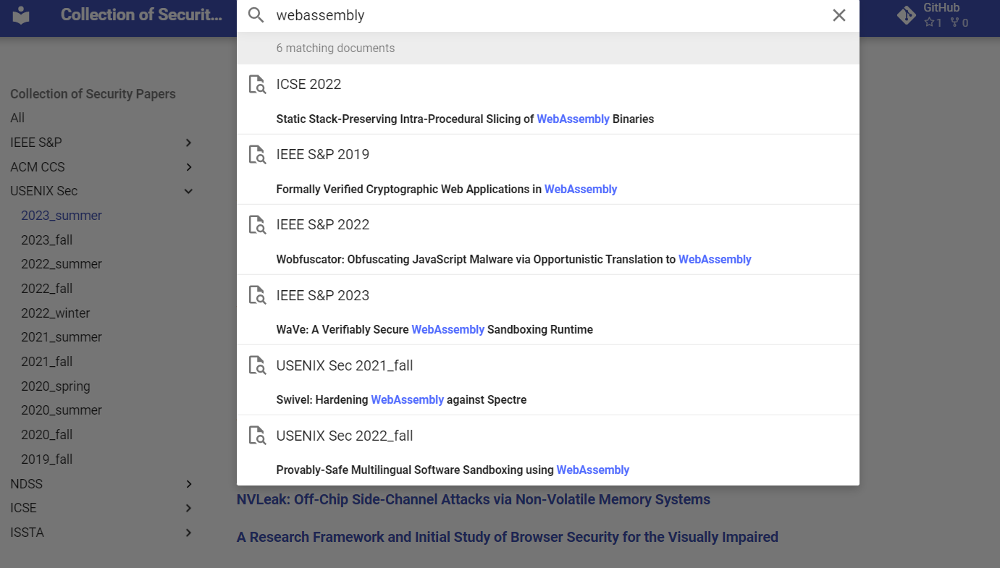

# A Collection of Security Papers on Top-Tier Conferences

    
**These papers are sorted by conference and date, and are deployed via github pages. Please [click here to visit the website](https://sec.c01dkit.com).**
    
The following publications are included:

- IEEE S&P (Oakland)
- USENIX Security Symposium (USENIX Sec)
- ACM CCS
- NDSS

Since some topics on software testing are related to security, the following publications are also included:

- ICSE
- ISSTA

**PRs and issues are warmly welcomed.**

To update, simply update `data.yml` and run `main.py` to crawl the latest information, then `mkdocs gh-deploy --clean` to deploy the website.

Here is a glance at all papers/posters:

| Publication | Date | Accepted Paper Number | Link |
| :---: | :---: | :---: | :---: |
| IEEE S&P | 2024 | 261 | [link](https://sp2024.ieee-security.org/accepted-papers.html)  |
| IEEE S&P | 2023 | 191 | [link](https://dblp.org/db/conf/sp/sp2023.html)  |
| IEEE S&P | 2022 | 148 | [link](https://dblp.org/db/conf/sp/sp2022.html)  |
| IEEE S&P | 2021 | 114 | [link](https://dblp.org/db/conf/sp/sp2021.html)  |
| IEEE S&P | 2020 | 104 | [link](https://dblp.org/db/conf/sp/sp2020.html)  |
| IEEE S&P | 2019 | 84 | [link](https://dblp.org/db/conf/sp/sp2019.html)  |
| IEEE S&P | 2018 | 63 | [link](https://dblp.org/db/conf/sp/sp2018.html)  |
| IEEE S&P | 2017 | 60 | [link](https://dblp.org/db/conf/sp/sp2017.html)  |
| IEEE S&P | 2016 | 55 | [link](https://dblp.org/db/conf/sp/sp2016.html)  |
| IEEE S&P | 2015 | 55 | [link](https://dblp.org/db/conf/sp/sp2015.html)  |
| ACM CCS | 2023 | 288 | [link](https://dblp.org/db/conf/ccs/ccs2023.html)  |
| ACM CCS | 2022 | 284 | [link](https://dblp.org/db/conf/ccs/ccs2022.html)  |
| ACM CCS | 2021 | 222 | [link](https://dblp.org/db/conf/ccs/ccs2021.html)  |
| ACM CCS | 2020 | 147 | [link](https://dblp.org/db/conf/ccs/ccs2020.html)  |
| ACM CCS | 2019 | 207 | [link](https://dblp.org/db/conf/ccs/ccs2019.html)  |
| ACM CCS | 2018 | 197 | [link](https://dblp.org/db/conf/ccs/ccs2018.html)  |
| ACM CCS | 2017 | 205 | [link](https://dblp.org/db/conf/ccs/ccs2017.html)  |
| ACM CCS | 2016 | 195 | [link](https://dblp.org/db/conf/ccs/ccs2016.html)  |
| ACM CCS | 2015 | 167 | [link](https://dblp.org/db/conf/ccs/ccs2015.html)  |
| USENIX Sec | 2024 | 226 | [link](https://www.usenix.org/conference/usenixsecurity24/summer-accepted-papers) [link](https://www.usenix.org/conference/usenixsecurity24/fall-accepted-papers)  |
| USENIX Sec | 2023 | 422 | [link](https://dblp.org/db/conf/uss/uss2023.html)  |
| USENIX Sec | 2022 | 256 | [link](https://dblp.org/db/conf/uss/uss2022.html)  |
| USENIX Sec | 2021 | 247 | [link](https://dblp.org/db/conf/uss/uss2021.html)  |
| USENIX Sec | 2020 | 159 | [link](https://dblp.org/db/conf/uss/uss2020.html)  |
| USENIX Sec | 2019 | 113 | [link](https://dblp.org/db/conf/uss/uss2019.html)  |
| USENIX Sec | 2018 | 101 | [link](https://dblp.org/db/conf/uss/uss2018.html)  |
| USENIX Sec | 2017 | 85 | [link](https://dblp.org/db/conf/uss/uss2017.html)  |
| USENIX Sec | 2016 | 72 | [link](https://dblp.org/db/conf/uss/uss2016.html)  |
| USENIX Sec | 2015 | 67 | [link](https://dblp.org/db/conf/uss/uss2015.html)  |
| NDSS | 2024 | 140 | [link](https://www.ndss-symposium.org/ndss-program/symposium-2024)  |
| NDSS | 2023 | 94 | [link](https://dblp.org/db/conf/ndss/ndss2023.html)  |
| NDSS | 2022 | 83 | [link](https://dblp.org/db/conf/ndss/ndss2022.html)  |
| NDSS | 2021 | 87 | [link](https://dblp.org/db/conf/ndss/ndss2021.html)  |
| NDSS | 2020 | 89 | [link](https://dblp.org/db/conf/ndss/ndss2020.html)  |
| NDSS | 2019 | 90 | [link](https://dblp.org/db/conf/ndss/ndss2019.html)  |
| NDSS | 2018 | 71 | [link](https://dblp.org/db/conf/ndss/ndss2018.html)  |
| NDSS | 2017 | 68 | [link](https://dblp.org/db/conf/ndss/ndss2017.html)  |
| NDSS | 2016 | 61 | [link](https://dblp.org/db/conf/ndss/ndss2016.html)  |
| NDSS | 2015 | 50 | [link](https://dblp.org/db/conf/ndss/ndss2015.html)  |
| ICSE | 2024 | 234 | [link](https://conf.researchr.org/track/icse-2024/icse-2024-research-track?#event-overview)  |
| ICSE | 2023 | 211 | [link](https://dblp.org/db/conf/icse/icse2023.html)  |
| ICSE | 2022 | 199 | [link](https://dblp.org/db/conf/icse/icse2022.html)  |
| ICSE | 2021 | 138 | [link](https://dblp.org/db/conf/icse/icse2021.html)  |
| ICSE | 2020 | 129 | [link](https://dblp.org/db/conf/icse/icse2020.html)  |
| ICSE | 2019 | 109 | [link](https://dblp.org/db/conf/icse/icse2019.html)  |
| ICSE | 2018 | 153 | [link](https://dblp.org/db/conf/icse/icse2018.html)  |
| ICSE | 2017 | 68 | [link](https://dblp.org/db/conf/icse/icse2017.html)  |
| ICSE | 2016 | 101 | [link](https://dblp.org/db/conf/icse/icse2016.html)  |
| ICSE | 2015-1 | 84 | [link](https://dblp.org/db/conf/icse/icse2015-1.html)  |
| ICSE | 2015-2 | 214 | [link](https://dblp.org/db/conf/icse/icse2015-2.html)  |
| ISSTA | 2024 | 42 | [link](https://2024.issta.org/track/issta-2024-papers#event-overview)  |
| ISSTA | 2023 | 138 | [link](https://dblp.org/db/conf/issta/issta2023.html)  |
| ISSTA | 2022 | 72 | [link](https://dblp.org/db/conf/issta/issta2022.html)  |
| ISSTA | 2021 | 59 | [link](https://dblp.org/db/conf/issta/issta2021.html)  |
| ISSTA | 2020 | 55 | [link](https://dblp.org/db/conf/issta/issta2020.html)  |
| ISSTA | 2019 | 53 | [link](https://dblp.org/db/conf/issta/issta2019.html)  |
| ISSTA | 2018 | 38 | [link](https://dblp.org/db/conf/issta/issta2018.html)  |
| ISSTA | 2017 | 54 | [link](https://dblp.org/db/conf/issta/issta2017.html)  |
| ISSTA | 2016 | 41 | [link](https://dblp.org/db/conf/issta/issta2016.html)  |
| ISSTA | 2015 | 44 | [link](https://dblp.org/db/conf/issta/issta2015.html)  |
